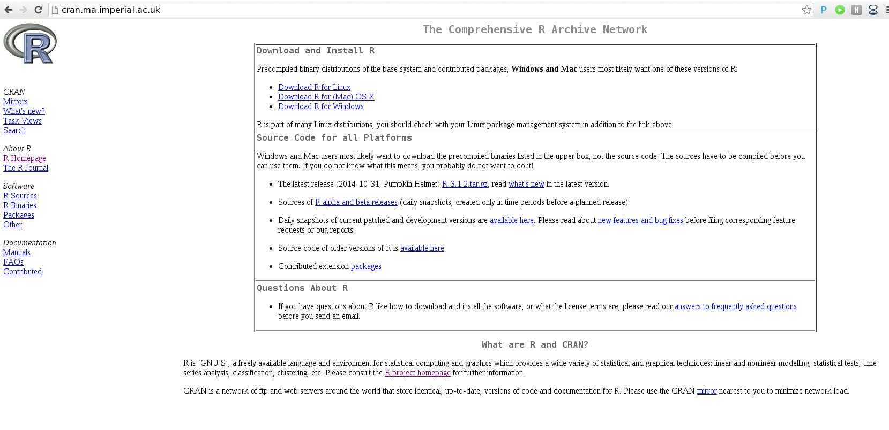
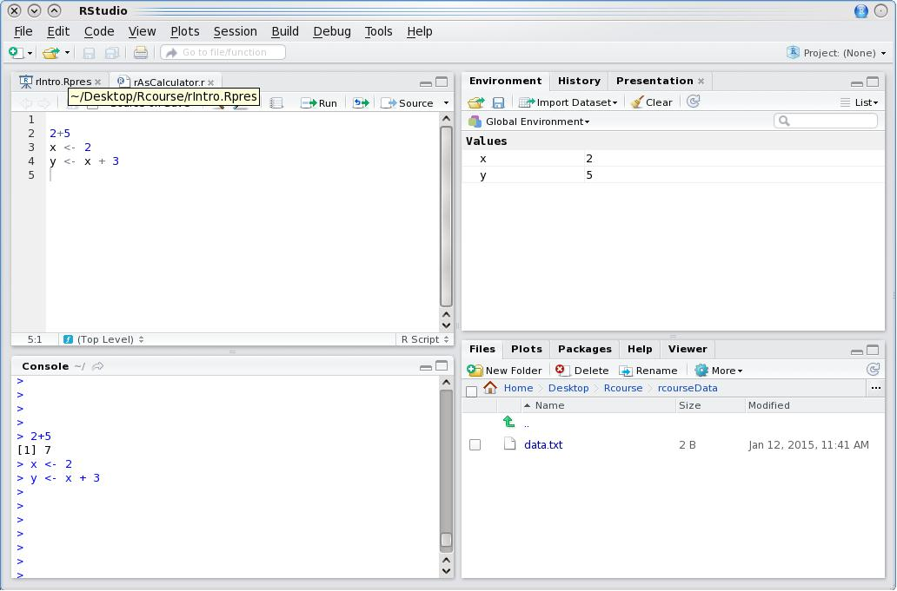
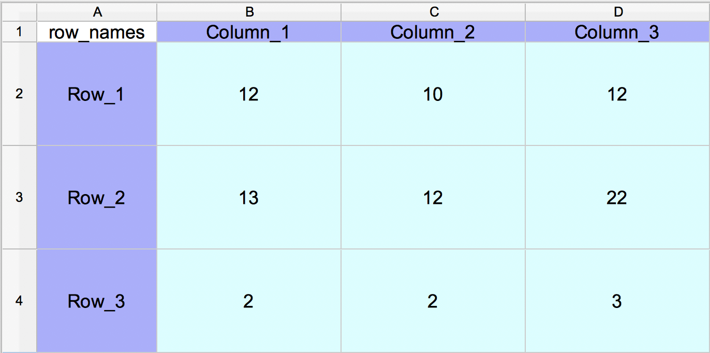
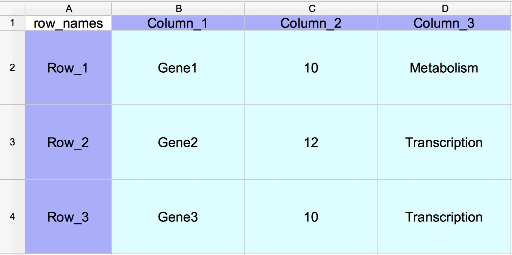

```{r,include=FALSE}
suppressPackageStartupMessages(require(knitr))
```

<!-- # (PART) Introduction to R {-} -->

# Introduction to R 

---

##  Overview 

- [Set up](#Set-up)
- [Background to R](#Background-to-R)
- [Data types in R](#datatypes)
- [Reading and writing in R](#datatypes)


---
class: inverse, center, middle

# Set-Up

<html><div style='float:left'></div><hr color='#EB811B' size=1px width=720px></html> 

---

## Materials.

All prerequisites, links to material and slides for this course can be found on github.
* [Intro_To_R_1](https://rockefelleruniversity.github.io/Intro_To_R_1Day/)

Or can be downloaded as a zip archive from here. 
* [Download zip](https://github.com/rockefelleruniversity/Intro_To_R_1Day/zipball/master)


---
## Materials. - Presentations, source code and practicals.


Once the zip file in unarchived. All presentations as HTML slides and pages, their R code and HTML practical sheets will be available in the directories underneath.

* **presentations/slides/**
Presentations as an HTML slide show.
* **presentations/singlepage/** 
Presentations as an HTML single page.
* **presentations/rcode/**
R code in presentations.
* **exercises/**
Practicals as HTML pages. 
* **answers/**
Practicals with answers as HTML pages and R code solutions. 


---
## Set the Working directory


Before running any of the code in the practicals or slides we need to set the working directory to the folder we unarchived. 

You may navigate to the unarchived Intro_To_R_1Day folder in the Rstudio menu

**Session -> Set Working Directory -> Choose Directory**

or in the console.

```{r setwd_introtoR,eval=F} 
setwd("/PathToMyDownload/Intro_To_R_1Day/r_course")
# e.g. setwd("~/Downloads/Intro_To_R_1Day/r_course")
```


---
class: inverse, center, middle

# Background to R

<html><div style='float:left'></div><hr color='#EB811B' size=1px width=720px></html> 

---
## What is R?


**R** is a scripting language and environment for **statistical computing**.


Developed by [Robert Gentleman](http://www.gene.com/scientists/our-scientists/robert-gentleman) and [Ross Ihaka](https://www.stat.auckland.ac.nz/~ihaka/). 


Inheriting much from **S** (Bell labs).

- Suited to high level data analysis
- Open source & cross platform
- Extensive graphics capabilities
- Diverse range of add-on packages
- Active community of developers
- Thorough documentation


---
## What is R to you?

.pull-left[

**R** comes with excellent "out-of-the-box" statistical and plotting capabilities.


**R** provides access to 1000s of packages ([CRAN](http://cran.r-project.org/)/[MRAN](http://mran.revolutionanalytics.com/)/[R-forge](https://r-forge.r-project.org/)) which extend the basic functionality of R while maintaining high quality documentation.


In particular, [Robert Gentleman](http://www.gene.com/scientists/our-scientists/robert-gentleman) developed the **[Bioconductor](http://bioconductor.org/)** project where 100's of packages are directly related to computational biology and analysis of associated high-throughput experiments.]
.pull-right[

]

---
## How to get R?

.pull-left[

Freely available from [R-project website](http://cran.ma.imperial.ac.uk/).

RStudio provides an integrated development environment (IDE) which is freely available from [RStudio site](http://www.rstudio.com/)


***We will be using RStudio and R already installed on your machines.***
]
.pull-right[


]

---
## A quick tour of RStudio

.pull-left[
Four main panels
- Scripting panel
- R interface
- Environment and history
- Files, directories and help


**Let's load RStudio and take a look**
]

.pull-right[




]

---
class: inverse, center, middle
# Data types in R

<html><div style='float:left'></div><hr color='#EB811B' size=1px width=720px></html> 

---

## Different Data types in R


- Simple calculations
- Variables
- Vectors
- Lists
- Matrices
- Data frames


---
## Simple Calculations 

At its most basic, **R** can be used as a simple calculator.
```{r simpleCalculations_introtoR,prompt=T}
3+1

2*2

sqrt(25)-1
```


---
## Using functions.

The **sqrt(25)** demonstrates the use of functions in R. A function performs a complex operation on it's arguments and returns the result.

In R, arguments are provided to a function within the parenthesis -- **( )** -- that follows the function name. So **sqrt(*ARGUMENT*)** will provide the square root of the value of ***ARGUMENT***.

Other examples of functions include **min()**, **sum()**, **max()**. 

Note multiple arguments are separated by a comma.

```{r usingFunctions_introtoR}
min(2,4,6)
sum(2,4,6)
max(2,4,6)
```


---
## Using functions.


R has many useful functions "built in" and ready to use as soon as R is loaded.

An incomplete, illustrative list can be seen [here](http://www.statmethods.net/management/functions.html) 

In addition to R standard functions, additional functionality can be loaded into R using libraries. These include specialised tools for areas such as sequence alignment, read counting etc.

If you need to see how a function works try **?** in front of the function name.
```{r usingFunctionsSQRT_introtoR}
?sqrt
```


Lets run [**?sqrt**](https://stat.ethz.ch/R-manual/R-devel/library/base/html/MathFun.html) in RStudio and look at the help.


---
## Using functions (Arguments have names and order)


With functions such as min() and sqrt(), the arguments to be provided are obvious and the order of these arguments doesnt matter.

```{r usingFunctionsArgOrder_introtoR}
min(5,4,6)
min(6,4,5)
```

Many functions however have an order to their arguments.
Try and look at the arguments for the dir() function using [?dir](https://stat.ethz.ch/R-manual/R-devel/library/base/html/list.files.html).

```
?dir
```

---
## Using functions (Setting names for arguments)


Often we know the names of arguments but not necessarily their order.
In cases where we want to be sure we specify the right argument, we provide names for the arguments used.

```{r usingFunctionsSetNames_introtoR,eval=F}
dir()
dir(full.names=T)
```

This also means we don't have to copy out all the defaults for arguments preceeding it.

```{r usingFunctionsDefaultOrder_introtoR,eval=F}
dir(full.names=T)
# Is equivalent to...
dir(".",NULL,FALSE,T)
```


---
## Variables 


As with other programming languages and even graphical calculators, **R** makes use of **variables**.

A **variable** stores a value as a letter or word.

In **R**, we make use of the assignment operator **<-** 
```{r variablesDefine_introtoR}
x <- 10
```
Now **x** holds the value of 10
```{r variableHold_introtoR}
x
```


---
## Variables.


```{r variableShowForAlterInPlace_introtoR}
x
```
Variables can be altered in place
```{r variableAlterInPlace_introtoR}
x <- 20
x
```

---

## Variables.

Variables can be used just as the values they contain.
```{r variableAsValueTheyContain_introtoR}
x
```

```{r variableAsValueFromFunTheyContain_introtoR}
x + sqrt(25)
```
Variables can be used to create new variables
```{r variableCreateNewVariable_introtoR}
y <- x + sqrt(25)
y
```


---
## Vectors

In **R** the most basic variable or data type is a **vector**. A vector is an ordered collection of values. The x and y variables we have previously assigned are examples of a vector of length 1.

```{r vectorBasic_introtoR}
x
length(x)
```

---
## Vectors

To create a multiple value vector we use the function **c()** to *combine* the supplied arguments into one vector.

```{r vectorCreate_introtoR}
x <- c(1,2,3,4,5,6,7,8,9,10)
x
length(x)
```


---
## Vectors

Vectors of continuous stretches of values can be created by the shortcut - **:**

```{r vectorSeqFromColon_introtoR}
y <- 6:10
y
```

Other useful function to create stretchs of numeric vectors are **seq()** and **rep()**.
The **seq()** function creates a sequence of numeric values from a specified start and end value, incrementing by a user defined amount. The **rep()** function repeats a variable a user-defined number of times.


```{r vectorSeqFromSeqAndRep_introtoR}
seq(from=1,to=5,by=2)
rep(c(1,5,10),3)
```


---
## Vectors - Indexing 

Square brackets **[]** identify the position within a vector (the **index**).
These indices can be used to extract relevant values from vectors.


```{r vectorIndexing_introtoR}
x
x[1]
x[8]
```

---
## Vectors - Indexing 


Indices can be used to extract values from multiple positions within a vector.

```{r vectorIndexingBy2_introtoR}
x[c(1,6)]
```
Negative indices can be used to extract all positions except that specified

```{r vectorIndexingByNeg_introtoR}
x[-5]
```


---
## Vectors - Indexing and replacement


We can use indices to modify a specific position in a vector

```{r vectorIndexingAndReplace_introtoR}
x
x[5] <- -5
x
```


---
## Vectors - Indexing and replacement

Indices can be specified using other vectors.

```{r vectorIndexingUsingVectors_introtoR}
y
x[y] <- 0
x
```


---
## Remember!


Square brackets **[]**  for indexing
```{r RememberSquareForIndex_introtoR}
x[1]
```

Parentheses **()**  for function argments.
```{r RememberRoundForFunctions_introtoR}
sqrt(4)
```


---
## Vectors - Arithmetic operations 


Vectors in R can be used in arithmetic operations as seen with [variables earlier](#/simplecalc).
When a standard arithmetic operation is applied to vector, the operation is applied to each position in a vector.

```{r vectorArithmetricOperations_introtoR}
x <- c(1,2,3,4,5,6,7,8,9,10)
x
y <- x*2
y
```

Multiple vectors can be used within arithmetic operations. 
```{r vectorArithmetricOperationsMultipleVectors_introtoR}
x+y
```

---
## Vectors - Arithmetic operations  


When applying an arithmetic operation between two vectors of unequal length, the shorter will be recycled.

```{r vectorRecycle_introtoR}
x <- c(1,2,3,4,5,6,7,8,9,10)
x
x+c(1,2)
```

```{r vectorShorterRecycle_introtoR}
x+c(1,2,3)
```


---
## Vectors - Character vectors.


So far we have only looked at numeric vectors or variables.

In R we can also create character vectors [again using **c()** function](#/combine). These vectors can be indexed just the same.

```{r vectorCharacters_introtoR}
y <- c("ICTEM","CommonWealth","Wolfson")
y[2]
```

Character vectors can be used to assign names to other vectors.

```{r vectorCharacterNames_introtoR}
x <- c(1:3)
names(x) <- y
x
```

---
## Vectors - Character vectors as names.


These named vectors maybe indexed by a position's "name".
```{r vectorCharacterNamesIndex_introtoR}
x[c("ICTEM","Wolfson")]
```
Index names missing from vectors will return special value "NA"
```{r vectorCharacterNamesIndexMissing_introtoR}
x[c("Strand")]
```


---
## A note on NA values


In R, like many languages, when a value in a variable is missing, the value is assigned a **NA** value.

Similarly, when a calculation can not be perfomed, R will input a **NaN** value.

- **NA** - Not Available.
- **NaN** - Not A Number.

**NA** values allow for R to handle missing data correctly but requires different handling than standard numeric or character values. We will illustrate an example handling **NA** values [later](#/nalast).


---
## Vectors - The unique() function


The unique() function can be used to retrieve all unique  values from a vector.

```{r vectorUnique_introtoR}
geneList <- c("Gene1","Gene2","Gene3","Gene4","Gene5","Gene1","Gene3")
unique(geneList)
```


---
## Vectors - Logical vectors


Logical vectors are a class of vector made up of TRUE/T or FALSE/F boolean values.

```{r vectorLogical_introtoR}
z <- c(T,F,T,F,T,F,T,F,T,F) 
# z <-  c(TRUE,FALSE,TRUE,FALSE,TRUE,FALSE,TRUE,FALSE,TRUE,FALSE) 
z
```
Logical vectors can be used like an index to specify postions in a vector. TRUE values will return the corresponding position in the vector being indexed.

```{r vectorLogicalOtherVector_introtoR}
x <- 1:10
x[z]
```


---
## Vectors - The %in% operator


A common task in R is to subset one vector by the values in another vector.

The **%in%** operator in the context **A %in% B** creates a logical vector of whether values in **A** matches any values in of **B**.

This can be then used to subset the values within one character vector by a those in a second. 

```{r vectorInFuncion_introtoR}
geneList <- c("Gene1","Gene2","Gene3","Gene4","Gene5","Gene1","Gene3")
secondGeneList <- c("Gene5","Gene3")
logical_index <- geneList %in% secondGeneList
logical_index

geneList[logical_index]
```


---
## Vectors . Logical vectors from operators


Vectors may be evaluated to produce logical vectors. This can be very useful when using a logical to index.

Common examples are:

- **==**  evaluates as equal.
- **>** and **<** evaluates as greater or less than respectively.
- **>=** and **<=** evaluates as greater than or equal or less than or equal respectively.

```{r vectorLogicalFromOperators_introtoR}
x <- 1:10
x > 5
x[x > 5]
```


---
## Vectors - Combining logical vectors.


Logical vectors can be used in combination in order to index vectors. To combine logical vectors we can use some common R operators.

- **&** - Requires both logical operators to be TRUE
- **|** - Requires either logical operator to be TRUE.
- **!** - Reverses the logical operator, so TRUE is FALSE and FALSE is TRUE.

```{r vectorLogicalCombine_introtoR}
x <- 1:10
!x > 4
x > 4 & x < 7
x > 4 | x < 7
```


---
## Vectors . Logical vectors continued.


Such combinations can allow for complex selection of a vector's values.
```{r vectorLogicalCombineIndex_introtoR}
x <- 1:10
x
x[x > 4 & x < 7]
x[x > 4 & !x < 7]
```


---
## Time for an exercise!


Exercise on vectors can be found [here](http://rockefelleruniversity.github.io/Intro_To_R_1Day/r_course/exercises/vector_exercise.html)


---
## Answers to exercise.


Answers can be found here  [here](http://rockefelleruniversity.github.io/Intro_To_R_1Day/r_course/answers/vector_answers.html)

R code for solutions can be found here  [here](http://rockefelleruniversity.github.io/Intro_To_R_1Day/r_course/answers/vector_answers.R)


---
## Matrices  - Creating matrices


In programs such as Excel, we are used to tables.

<div align="center">

</div>

---
## Matrices - Creating matrices

All progamming languages have a concept of a table. In **R**, the most basic table type is a **matrix**.

A **matrix** can be created using the ***matrix()*** function with the arguments of **nrow** and **ncol** specifying the number of rows and columns respectively.
```{r matricesCreate_introtoR}
narrowMatrix <- matrix(1:10, nrow=5, ncol=2)
narrowMatrix

wideMatrix <- matrix(1:10, nrow=2, ncol=5)
wideMatrix
```


---
## Matrices - Creating matrices


By default when creating a matrix using the **matrix** function, the values fill the matrix by columns. To fill a matrix by rows the **byrow** argument must be set to TRUE.

```{r matricesCreateByRow_introtoR}
wideMatrix <- matrix(1:10, nrow=2, ncol=5)
wideMatrix

wideMatrixByRow <- matrix(1:10, nrow=2, ncol=5, byrow=TRUE)
wideMatrixByRow
```


---
## Matrices - Finding dimensions


To find dimensions of a matrix, the **dim()** function will provide dimensions as the row then column number while **nrow()** and **ncol()** will return just row number and column number respectively.
```{r matricesDim_introtoR}
dim(narrowMatrix)
nrow(narrowMatrix)
ncol(narrowMatrix)
```


---
## Matrices (Joining vectors and matrices)


A matrix can be created from multiple vectors or other matrices.

**cbind()** can be used to attach data to a matrix as columns.
```{r matricesCbind_introtoR}
x <- 1:5
y <- 11:15
z <- 21:22
newMatrix <- cbind(x,y)
newMatrix
```

---
## Matrices - (Joining vectors and matrices)

**rbind()** functions to bind to a matrix as rows.
```{r matricesRbind_introtoR}
newerMatrix <- rbind(newMatrix,z)
newerMatrix
```


---
## Matrices - Joining incompatable vectors and matrices


When creating a matrix using **cbind()** or **matrix()** from incompatable vectors then the shorter vector is recycled. 


```{r matricesJoinIncompatable_introtoR}
recycledMatrix2 <- matrix(1:5,ncol=2,nrow=3)
recycledMatrix2
```

---
## Matrices - Joining incompatable vectors and matrices


For **rbind()** function, the longer vector is clipped.
```{r matricesJoinIncompatableClip_introtoR}
recycledMatrix3 <- rbind(recycledMatrix2,c(1:5))
recycledMatrix3
```


---
## Matrices  - Column and row names


[As we have seen with vectors](#/namingvectors), matrices can be named. For matrices the naming is done by columns and rows using **colnames()** and **rownames()** functions.

```{r matricesNames_introtoR}
namedMatrix <- matrix(1:10,ncol=5,nrow=2)
colnames(namedMatrix) <- paste("Column",1:5,sep="_")
rownames(namedMatrix) <- paste("Row",1:2,sep="_")
namedMatrix
```

---
## Matrices - Column and row names

Information on matrix names can also be retreived using the same functions.
```{r matricesNamesColRow_introtoR}
colnames(namedMatrix)
rownames(namedMatrix)
```


---
## Matrices  - Indexing


Selecting and replacing portions of a matrix can be done by **indexing** using square brackets **[]** much [like for vectors](#indexingvectors).

When indexing matrices, two values may be provided within the square brackets separated by a comma to retrieve information on a matrix position.

The first value(s) corresponds to row(s) and the second to column(s).

- ***myMatrix[rowOfInterest,columnOfInterest]***
```{r matricesIndexing_introtoR}
narrowMatrix
```


---
## Matrices - Indexing

```{r matricesIndexingShow_introtoR}
narrowMatrix
```
Value of first column, second row
```{r matricesIndexingExample_introtoR}
narrowMatrix[2,1]
```


---
## Matrices - Indexing 


Similarly, whole rows or columns can be extracted. Single rows and columns will return a vector.  


Values of second column (row index is empty!)
```{r matricesIndexingExampleByCol_introtoR}
narrowMatrix[,2]
```

Values of third row (column index is empty!)
```{r matricesIndexingExampleByRow_introtoR}
narrowMatrix[3,]
```

---
## Matrices - Indexing 

When multiple columns or row indices are specified, a matrix is returned.

Values of second and third row (column index is empty!)
```{r matricesIndexingExampleByMultipleRow_introtoR}
narrowMatrix[c(2,3),]
```


---
## Matrices - Indexing by name


As with vectors, names can be used for indexing when present

```{r matricesIndexingExampleByName_introtoR}
colnames(narrowMatrix) <- paste("Column",1:2,sep="_")
rownames(narrowMatrix) <- paste("Row",1:5,sep="_")
narrowMatrix[,"Column_1"]
narrowMatrix["Row_1",]
narrowMatrix["Row_1","Column_1"]
```


---
## Matrices - Advanced indexing


As with vectors, matrices can be subset by logical vectors
```{r matricesIndexingExampleByLogic_introtoR}
narrowMatrix
narrowMatrix[,1]
narrowMatrix[,1] < 5
```

```{r matricesIndexingExampleByLogicRow_introtoR}
narrowMatrix[narrowMatrix[,1] < 5,]
```


---
## Matrices  - Arithmetic operations.


As with vectors, matrices can have arithmetic operations applied to cells,rows, columns or the whole matrix
```{r matricesArithmetric_introtoR}
narrowMatrix
narrowMatrix[1,1]+2
narrowMatrix[1,]+2
mean(narrowMatrix)

```


---
## Matrices - Replacement


As with vectors, matrices can have their elements replaced
```{r matricesReplace_introtoR}
narrowMatrix
narrowMatrix[1,1] <- 10
narrowMatrix[,2] <- 1
narrowMatrix
```


---
## Matrices -Matrices can contain only one data type

Matrices must be all one type (i.e. numeric or character).

Here replacing one value with character will turn numeric matrix to character matrix.

```{r,matricesOneTypeOnlyNoError_introtoR,error=T}
narrowMatrix[,2] *2
```
```{r matricesOneTypeOnlyExampleForError_introtoR}
narrowMatrix[1,1] <- "Not_A_Number"
narrowMatrix
```

```{r matricesOneTypeOnlyWithError_introtoR,error=T}
narrowMatrix[,2] *2
```


---
## Time for an exercise!


Exercise on matrices can be found [here](http://rockefelleruniversity.github.io/Intro_To_R_1Day/r_course/exercises/matrices_exercise.html)


---
## Answers to exercise.


Answers can be found here  [here](http://rockefelleruniversity.github.io/Intro_To_R_1Day/r_course/answers/matrices_answers.html)

R code for solutions can be found [here](http://rockefelleruniversity.github.io/Intro_To_R_1Day/r_course/answers/matrices_answers.R)


---
## Factors - Creating factors


A special case of a vector is a **factor**.

Factors are used to store data which may be grouped in categories (categorical data).
Specifying data as categorical allows R to properly handle the data and make use of functions specific to categorical data.

To create a factor from a vector we use the **factor()** function. Note that the factor now has an additional component called **"levels"** which identifies all categories within the vector.

```{r factorsIntro_introtoR}
vectorExample <- c("male","female","female","female")
factorExample <- factor(vectorExample)
factorExample
levels(factorExample)
```


---
## Factors - Summary() function


An example of the use of levels can be seen from applying the **summary()** function to the vector and factor examples


```{r factorsSummaryFunction_introtoR}
summary(vectorExample)
summary(factorExample)
```


---
## Factors - Display order of levels

In our factor example, the levels have been displayed in an alphabetical order. To adjust the display order of levels in a factor, we can supply the desired display order to **levels** argument in the **factor()** function call.

```{r factorsDisplayOrder_introtoR}
factorExample <- factor(vectorExample,levels=c("male","female"))
factorExample
summary(factorExample)
```


---
## Factors - Nominal factors

In some cases there is no natural order to the categories such that one category is greater than the other (nominal data).
In this case we can see that R is gender neutral.

```{r factorsNominal_introtoR}
factorExample <- factor(vectorExample,levels=c("male","female"))
factorExample[1] < factorExample[2]
```


---
## Factors  - Ordinal factors


In other cases there will be a natural ordering to the categories (ordinal data). A factor can be specified to be ordered using the **ordered** argument in combination with specified levels argument.

```{r factorsOrdinal_introtoR}
factorExample <- factor(c("small","big","big","small"),
                        ordered=TRUE,levels=c("small","big"))
factorExample
factorExample[1] < factorExample[2]
```


---
## Factors - Replacement


Unlike vectors, replacing elements within a factor isn't so easy. While replacing one element with an established level is possible, replacing with a novel element will result in a warning.

```{r factorsOrder_introtoR}
factorExample <- factor(c("small","big","big","small"))
factorExample[1] <- c("big")
factorExample

factorExample[1] <- c("huge")
factorExample

```

---
## Factors - Replacement

To add a new level we can use the levels argument.

```{r factorsAddNew_introtoR}
levels(factorExample) <- c("big","small","huge")
factorExample[1] <- c("huge")
factorExample
```


---
## Data frames - Creating data frames 


[We saw that with matrices you can only have one type of data](#/onedatatype). We tried to create a matrix with a character element and the entire matrix became a character.

In practice, we would want to have a table which is a mixture of types (e.g a table with sample names (character), sample type (factor) and survival time (numeric))

<div align="center">

</div>
---
## Data frames - Creating data frames 


In R, we make use of the **data frame** object which allows us to store tables with columns of different data types. To create a data frame we can simply use the **data.frame()** function.

```{r dataframesIntro_introtoR}
patientName <- c("patient1","patient2","patient3","patient4")
patientType <- factor(rep(c("male","female"),2))
survivalTime <- c(1,30,2,20)
dfExample <- data.frame(Name=patientName, Type=patientType,Survival_Time=survivalTime)
dfExample
```


---
## Data frames - Indexing and replacement


Data frames may be indexed just [as matrices](#/indexingmatrices).

```{r dataframesReplacement_introtoR}
dfExample
dfExample[dfExample[,"Survival_Time"] > 10,]
```

---
## Data frames - Using $ to specify columns

Unlike matrices, it is possible to index a column by using the **$** symbol.

```{r dataframesReplacementbyDollar_introtoR}
dfExample <- data.frame(Name=patientName,Type=patientType,Survival_Time=survivalTime)
dfExample$Survival_Time
dfExample[dfExample$Survival_Time < 10,]
```

---
## Data frames - Creating data frames 

Using the **$** allows for R to autocomplete your selection and so can speed up coding.

```{r dataframesIndexbyDollar_introtoR}
dfExample$Surv
```
But this will not work..
```{r dataframesIndexbyName_introtoR, eval=F}
dfExample[,"Surv"]
```


---
## Data frames - Creating new columns with $


The **$** operator also allows for the creation of new columns for a data frame on the fly.

```{r dataframesNewbyDollar_introtoR}
dfExample
dfExample$newColumn <- rep("newData",nrow(dfExample))
dfExample
```


---
## Data frames - Indexing and replacement


Certain columns can not be replaced in data frames. Numeric columns may have their values replaced but columns with character values may not by default. 


```{r dataframesNoReplace_introtoR}
dfExample[dfExample[,"Survival_Time"] < 10,"Survival_Time"] <- 0
dfExample
```

---
## Data frames - Indexing and replacement

This occurs because character vectors are treated as factors by default.

```{r dataframesNoReplaceString_introtoR}
dfExample[dfExample[,"Survival_Time"] < 10,"Name"] <- "patientX"
dfExample
```


---
## Data frames - Factors in data frames

It is possible to update factors in data frames just as with standard factors.

```{r dataframesAndFactors_introtoR}
dfExample <- data.frame(Name=patientName,Type=patientType,
                        Survival_Time=survivalTime)

levels(dfExample[,"Name"]) <- c(levels(dfExample[,"Name"]) ,
                                "patientX")

dfExample[dfExample[,"Survival_Time"] < 10,"Name"] <- "patientX"
dfExample

```


---
## Data frames - Creating data frames without factors

If you wish to avoid using factors in data frames then the **stringsAsFactors** argument to **data.frame()** function should be set to **FALSE**

```{r dataframesAndNoFactors_introtoR}
dfExample <- data.frame(Name=patientName,
                        Type=patientType,
                        Survival_Time=survivalTime,
                        stringsAsFactors = F)


dfExample[dfExample[,"Survival_Time"] < 10,"Name"] <- "patientX"
dfExample

```


---
## Data frames - Ordering with order() function

A useful function in R is **order()**

For numeric vectors, **order()** by default returns the indices of a vector in that vector's increasing order. This behaviour can be altered by using the "decreasing" argument passed to order.

```{r dataframesOrder_introtoR}
testOrder <- c(2,1,3)
testOrder
testOrder[order(testOrder)]
testOrder[order(testOrder,decreasing=T)]
```

---
## Data frames  - Ordering with NA values

When a vector contains NA values, these NA values will, by default, be placed last in ordering indices. This can be controlled by **na.last** argument.

```{r dataframesOrderWithNA_introtoR}
testOrder <- c(2,1,NA,3)
testOrder[order(testOrder,decreasing=T,na.last=T)]
testOrder[order(testOrder,decreasing=T,na.last=F)]
```


---
## Data frames  - Ordering data frames 

Since the order argument returns an index of intended order for a vector, we can use the order() function to order data frames by certain columns
```{r dataframesOrderDecreasing_introtoR}
dfExample
dfExample[order(dfExample$Surv, decreasing=T),]
```

---
## Data frames - Ordering data frames 


We can also use order to arrange multiple columns in a data frame by providing multiple vectors to order() function. Ordering will be performed in order of arguments.

```{r dataframesOrderMultiple_introtoR}
dfExample[order(dfExample$Type,
                dfExample$Survival,
                decreasing=T),]
```


---
## Data frames - Merging data frames

A common operation is to join two data frames by a column of common values.


```{r dataframesMergeData1_introtoR}
dfExample <- data.frame(Name=patientName,Type=patientType,
                        Survival_Time=survivalTime)
dfExample 
```


```{r dataframesMergeData2_introtoR}
dfExample2 <- data.frame(Name=patientName[1:3],
                        height=c(6.1,5.1,5.5))
dfExample2
```

---
## Data frames - Merging data frames with merge()


To do this we can use the **merge()** function with the data frames as the first two arguments. We can then specify the columns to merge by with the **by** argument. To keep only data pertaining to values common to both data frames the **all** argument is set to FALSE.

```{r dataframesMerge_introtoR}
mergedDF <- merge(dfExample,dfExample2,by=1,all=F)
mergedDF
```


---
## Time for an exercise!


Exercise on data frames can be found [here](http://rockefelleruniversity.github.io/Intro_To_R_1Day/r_course/exercises/factorsAndDataframes_Exercise.html)


---
## Answers to exercise.


Answers can be found here  [here](http://rockefelleruniversity.github.io/Intro_To_R_1Day/r_course/answers/factorsAndDataframes_Answers.html)

R code solutions can be found [here](http://rockefelleruniversity.github.io/Intro_To_R_1Day/r_course/answers/factorsAndDataframes_Answers.R)


---
## Lists - Creating lists


Lists are the final data-type we will look at. 

In R, lists provide a general container which may hold any data types of unequal lengths as part of its elements.

```{r listsExample_introtoR}
firstElement <- c(1,2,3,4)
secondElement <- matrix(1:10,nrow=2,ncol=5)
thirdElement <- data.frame(colOne=c(1,2,4,5),colTwo=c("One","Two","Three","Four"))
```
---
## Lists -  lists
To create a list we can simply use the **list()** function with arguments specifying the data we wish to include in the list.

```{r listsCreate_introtoR}
myList <- list(firstElement,secondElement,thirdElement)
myList
```


---
## Lists -  Named lists


[Just as with vectors](#/namingvectors), list elements can be assigned names.

```{r listsCreateNnames_introtoR}
myNamedList <- list(First=firstElement,Second=secondElement,
                    Third=thirdElement)
myNamedList
```

---
## Lists - Indexing


List, as [with other data types in R](#/indexingvectors) can be indexed. In contrast to other types, using **[]** on a list will subset the list to another list of selected indices. To retrieve an element from a list in R , two square brackets **[[]]** must be used. 

```{r listsCreateElements_introtoR}
myList <- list(firstElement,secondElement,thirdElement)
myList[1]
myList[[1]]
```

As with data.frames, the $ sign may be used to extract named elements from a list

```{r listsIndexElements_introtoR}
myNamedList$First
```


---
## Lists - Joining lists


Again, [similar to vectors](#/combine), lists can be joined together in R using the c() function 

```{r listsCombine_introtoR}
myNamedList <- list(First=firstElement,Second=secondElement,
                    Third=thirdElement)
myNamedList <- c(myNamedList,list(fourth=c(4,4)))
myNamedList[c(1,4)]

```


---
## Lists  - Joining vectors to lists


Note that on last slide we are joining two lists. If we joined a vector to a list, all elements of the vector would become list elements.

```{r, listsCombineVector_introtoR}
myList <- c(myList,c(4,4))
myList[3:5]
```


---
## Lists - Flattening lists


Sometimes you will wish to "flatten" out a list. When a list contains compatable objects, i.e. list of all one type, the **unlist()** function can be used. Note the maintenance of names with their additional sufficies.

```{r listsFlatten_introtoR}
myNamedList <- list(First=c(1,2,3),Second=c(2,6,7),Third=c(1,4,7))
myNamedList
flatList <- unlist(myNamedList)
flatList[1:7]
```


---
## Lists - Flattening lists to matrices

A common step is to turn a list of standard results into matrix. This can be done in a few steps in R.

```{r listsFlattenToMatrix_introtoR}
myNamedList <- list(First=c(1,2,3),Second=c(2,6,7),Third=c(1,4,7))
flatList <- unlist(myNamedList)
listAsMat <- matrix(flatList,
                    nrow=length(myNamedList),
                    ncol=3,
                    byrow=T,
                    dimnames=list(names(myNamedList)))
listAsMat
```


---
class: inverse, center, middle

# Reading and writing data in R

<html><div style='float:left'></div><hr color='#EB811B' size=1px width=720px></html> 

---
## Data IO - Data from External sources


Most of the time, you will not be generating data in R but will be importing data from external files.

A standard format for this data is a table

```{r,echo=F}
minRep <- rbind(cbind(matrix(rnorm(12,4),ncol=3,byrow = T),matrix(c(rnorm(9,4),rnorm(3,8)),ncol=3,byrow = T)),
cbind(matrix(rnorm(12,10),ncol=3,byrow = T),matrix(c(rnorm(6,3),rnorm(6,10)),ncol=3,byrow = T)))
colnames(minRep) <- paste0(c("Sample_"),
                      1:5,".",sort(rep(c("hi","low"),3)))
minRepdf <- data.frame(Gene_Name=paste("Gene",letters[1:8],sep="_"),minRep)
#minRepdf$Gene_Name <- paste("Gene",letters[1:8],sep="_")
#write.table(minRepdf,file="readThisTable.csv",sep=",",row.names=F)
kable(minRepdf[,1:4], format='html')

```

---
## Data IO - Data from text file with read.table()


Tables from text files can be read with **read.table()** function

```{r,echo=T}
Table <- read.table("data/readThisTable.csv",sep=",",header=T)
Table[1:4,1:3]
```

Here we have provided two arguments. 
- **sep** argument specifies how columns are separated in our text file. ("," for .csv, "\t" for .tsv)
- **header** argument specifies whether columns have headers.

---
## Data IO - Row names in read.table()


read.table() allows for significant control over reading files through its many arguments. Have a look at options by using **?read.table**

The **row.names** argument can be used to specify a column to use as row names for the resulting data frame. Here we use the first column as row names.

```{r,echo=T}
Table <- read.table("data/readThisTable.csv",sep=",",header=T,row.names=1)
Table[1:4,1:3]
```

---
## Data IO - Setting factors from read.table()

As mentioned, data which is read into R through read.table() will be of data frame class.

To avoid character columns being converted into factors, we can specify the **stringsAsFactors** argument here.

```{r,echo=T}
Table <- read.table("data/readThisTable.csv",sep=",",header=T,stringsAsFactors=F)
```

Other very useful functions for read table include:
- **skip** - To set number of lines to skip when reading.
- **comment.char** - To set the start identifier for lines not to be read.

---
## Data IO - Data from other sources


The read.table function can also read data from http.

```{r,echo=T}
URL <- "http://rockefelleruniversity.github.io/readThisTable.csv"
Table <- read.table(URL,sep=",",header=T)
Table[1:2,1:3]
```
And the clipboard.(This is Windows version)

```{r,eval=F}
Table <- read.table(file="clipboard",sep=",",header=T)
```

---
## Data IO - Data from file columns


read.table() function will by default read every row and column of a file.

The **scan()** function allows for the selection of particular columns to be read into R and so can save memory when files are large. 


```{r,echo=T}
x <- scan("data/readThisTable.csv",sep=",",
what = c("character",rep("numeric", 6)),skip=1)
x[1:3]
```

---
## Data IO - Writing data to file


Once we have our data analysed in R, we will want to export it to a file. 

The most common method is to use the write.table() function

```{r,echo=T}
write.table(Table,file="data/writeThisTable.csv",sep=",")
```

Since our data has column names but no row names, I will provide the arguments col.names and row.names to write.table()

```{r,echo=T}
write.table(Table,file="data/writeThisTable.csv", sep=",", row.names =F,col.names=T)
```


---
## The rio (R io) package.

We may want to import from formats other than plain text.

We can make use of an R package (the rio package) which allows us to import and export data to mulitple formats.

Formats include:-

* XML
* Matlab, SAS, SPSS and minitab output formats.
* Excel and OpenOffice formats.


---
## The rio package.

To make use of the rio package functionality we will need to install this package to our version of R.

We can do this by using the **install.packages()** function with the package we wish to install.

**install.packages(_PACKAGENAME_)**

```{r,echo=T,eval=FALSE}
install.packages("rio")
```


---
## The rio package.

Once we have installed a package, we will need to load it to make the functions available to us.

We can load a library by using the **library()** function with package we wish to install

**library(_PACKAGENAME_)**

```{r,echo=T,eval=TRUE}
library("rio")
```

---
## The rio package.

The main two functions in the rio package are the **import** and **export** functions.

We can use the **import()** function to read in our csv file. We simple specify our file as an argument to the **import()** function..

**import(_Filename_)**

```{r,echo=T,eval=TRUE}
Table <- import("data/readThisTable.csv")
Table[1:2,]
```

---
## The rio package.

By default we will only retrieve the first sheet.

We can specify the sheet by name or number using the **which** argument.

```{r,echo=T,eval=TRUE}
Table <- import("data/readThisXLS.xls", 
                which=2)
Table <- import("data/readThisXLS.xls", 
                which="Metadata")
Table[1:2,]
```

---
## The rio package.

If we want to import all sheets, we can use the **import_list**.

This returns a *list* containing our two spreadsheets. The list has two elements named after the corresponding XLS sheet.

```{r,echo=T,eval=TRUE}
Table <- import_list("data/readThisXLS.xls")
names(Table)
```

---
## The rio package.

Since this is a list of data.frames, we can access our sheets using standard list accessors, **$** and **[[]]**.

```{r,echo=T,eval=TRUE}
## Table[["ExpressionScores"]][1:2,]
Table$ExpressionScores[1:2,]
Table$Metadata[1:2,]
```

---
## The rio package.

We can export our data back to file using the **export()** function and specifying the name of the output file to the **file** argument. The **export()** function will guess the format required from the extension.

```{r,echo=T,eval=TRUE}
ExpressionScores <- Table$ExpressionScores
export(ExpressionScores,file = "data/writeThisXLSX.xlsx")

```


---
## The rio package.

We can export a list of data.frames to Excel's xlsx format using the **export()** function. The names of list elements will be used to name sheets in xlsx file.

```{r,echo=T,eval=TRUE}
names(Table) <- c("expr","meta")
export(Table,file = "data/writeThisMultipleXLSX.xlsx")

```


---
## Time for an exercise!


Exercise on reading and writing data can be found [here](http://rockefelleruniversity.github.io/Intro_To_R_1Day/r_course/exercises/DataInputOutput_Exercises.html)

---
## Answers to exercise.


Answers can be found [here](http://rockefelleruniversity.github.io/Intro_To_R_1Day/r_course/answers/DataInputOutput_answers.html)

R code for solutions can be found [here](http://rockefelleruniversity.github.io/Intro_To_R_1Day/r_course/answers/DataInputOutput_answers.R)


