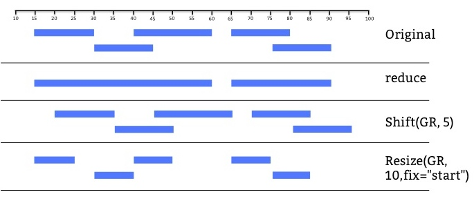

## Overview

- Introduction to Bioconductor
- GenomicRanges
- Reading Sequence alignemnts
- Annotations
- Exercises


## Bioconductor
Bioconductor (BioC) is an open source, open development software project to provide tools for the analysis and comprehension of high-throughput genomics data 

- Started in 2001
- Gained popularity through microarray analysis packages
- Colloborative effort by developers across the world
- Distributed as R packages
- Two releases every year

## Objectives
- Provide access to powerful statistical and graphical methods for analysing genomics data.
- Facilitate retrieval and integration of annotation data (GenBank, GO, Entrez Gene, PubMed).
- Allow the rapid development of extensible, interoperable, and scalable software.
- Promote high-quality documentation and reproducible research.
- Provide training in computational and statistical methods.

## www.bioconductor.org


## Bioconductor Release 3.0 
- Software (934)
    + Provides implementation of analysis methods
- AnnotationData (870)
    + mapping between microarray probe, gene, pathway, gene ontology, homology and other annotations
    + Representations of GO, KEGG and other annotations, and can easily access NCBI, Biomart, UCSC and other sources
- ExperimentData (219)
    + code, data and documentation for specific experiments or projects

## Installating BioC Packages
Installing & Using a package:

```{r eval=FALSE}
source("http://bioconductor.org/biocLite.R")
biocLite("GenomicRanges")
library("GenomicRanges")
```

## Finding Help

- ?function 
```{r eval=FALSE}
library("limma")
?lmFit
```
- Browse Vignettes browseVignettes(package="limma")
- Bioconductor Course Materials: http://www.bioconductor.org/help/course-materials/
- Bioconductor mailing list -  https://support.bioconductor.org/

Prints version information about R and all loaded packages
```{r eval=FALSE}
sessionInfo()
```


## BioC packages for Sequencing Data Analysis {#highlight1 .smaller}
- <b>Data structures</b>: IRanges, GenomicRanges, Biostrings, BSgenome
- <b>Input/Ouput</b>: ShortRead, Rsamtools, GenomicAlignments and rtracklayer (GTF,GFF,BED)
- <b>Annotation</b>: GenomicFeatures, BSgenome, biomaRt, TxDb.\*, org.\*
- <b>Alignment</b>: Rsubread, Biostrings
- <b>Accessing Database</b>: SRAdb & GEOquery 
- <b>ChIP-seq peak identification, motif discovery and annotation</b>: ChIPQC, chipseq, ChIPseqR, ChIPpeakAnno, DiffBind, rGADEM, BayesPeak, MotifDb, SeqLogo.
- <b>RNA-seq and Differential expression analysis</b>: Rsubread, GenomicAlignments, edgeR, DESeq2, DEXseq, goseq
- <b>SNP</b>: snpStats, SeqVarTools, GGtools
- <b>Work-flows</b>: ReportingTools, easyRNASeq, ArrayExpressHTS, oneChannelGUI


## GenomicRanges

- Genomic Ranges provides data structure for efficiently storing genomic coordinates
    + Collection of genes coordinates
    + Transcription factor binding sites (ChIP-Seq peaks)
    + Collection of aligned sequencing reads
- Builds on top of Interval Ranges (IRanges) package and lays foundation for sequencing analysis. 
- IRanges are collection of integer interval and GenomicRanges extends IRanges by including chromosome and strand.
- Provides collection of functions for accessing and manipulating Genomic coordinates
- Use cases: Identifying TF binding overlap, counting sequencing reads overlap with a gene
- Main classes: GRanges and GRangesList

## Run Length Encoding (Rle)
- Run length encoding is a data compression technique
- Efficiently encoding the redundant information


```{r, echo=TRUE, eval=TRUE, message=FALSE}

# Orginial vector
# chr1, chr2, chr2, chr2, chr1, chr1, chr3, chr3

library(GenomicRanges)
chr <- Rle(c("chr1", "chr2", "chr1", "chr3"), c(1, 3, 2, 2))
chr
```

The above Rle can be interpreted as a run of length 1 of chr1, followed by run length of 3 of chr2, followed by run length of 2 of chr1 and followed by run length of 2 of chr3

## Constructing GRanges object {.smaller}

GRanges class represents a collection of genomic features with single start and end location on the genome.  GRanges object can be cretated using <b>GRanges</b> function.

```{r, echo=TRUE, eval=TRUE, message=FALSE}
library("GenomicRanges")
gr1 <- GRanges(seqnames = Rle(c("chr1", "chr2", "chr1", "chr3"), c(1, 3, 2, 4)),
               ranges = IRanges(start=11:20, end = 50:59, names = head(letters,10)),
               strand = Rle(c("-", "+", "-", "+", "-"), c(1,2, 2, 3, 2)),
               score = 1:10, GC = runif(10,0,1))
gr1
```

## Constructing GRanges object {.smaller}

- The coordinates in GRanges are 1-based and left-most (start of a read will always be left-most coordinate of the read regardless of which strand the read aligned to).
- Additional data stored beyond genomic coordinates (separated by “|”) are called metadata. In our case metadata column contains score and GC content. 
- Metadata columns are optional and can be extracted from GRanges object using <b>mcols</b> function.

```{r, echo=TRUE, eval=TRUE, message=FALSE}
mcols(gr1)
```

## Constructing GRanges object from data frame

```{r, echo=TRUE, eval=TRUE, message=FALSE}
mm9genes <- read.table("mm9Genes.txt",sep="\t",header=T)
head(mm9genes)
mm9genes.GR <- GRanges(seqnames=mm9genes$chr,
                       ranges=IRanges(start=mm9genes$start,end=mm9genes$end),
                       strand=mm9genes$strand,
                       ENSID=mm9genes$ens,
                       Symbol=mm9genes$Symbol)
```

Another option: <b>makeGRangesFromDataFrame()</b> 

Converting GRanges object to data frame: <b>as.data.frame(GRanges)</b>

## Constructing GRanges object from data frame
```{r, echo=TRUE, eval=TRUE, message=FALSE}
head(mm9genes.GR)
```

## GenomicRangesList

- To represent hierarchical structured data, ex: Exons in a transcript
- List-like data structure
- Each element of the list is GRanges instance

```{r, echo=TRUE, eval=TRUE, message=FALSE}
gr2 <- GRanges(seqnames = Rle(c("chr1", "chr3","chr2", "chr1", "chr3"), c(1, 2,1, 2, 4)),
                ranges = IRanges(start=55:64, end = 94:103, names = letters[11:20]),
                strand = Rle(c("+", "-", "+", "-"), c(1, 4, 3, 2)),
                score = 1:10, GC = runif(10,0,1))

GRL <- GRangesList("Peak1" = gr1, "Peak2" = gr2)
```


## Operations on GenomicRanges

Operations       Functions/methods
----------      -----------------------------------------
Accessors       seqnames, start, end, ranges, strand, width, names, mcols, length
Extraction      GR[i], GRL[[i]], head, tail
Set operations  reduce, disjoin
Overlaps        findOverlaps, subsetByOverlaps, countOverlaps, nearest, precede, follow
Arithmetic      shift, resize, distance, distanceToNearest


## Operations on GenomicRanges



## Operations on GenomicRanges
```{r, echo=TRUE, eval=TRUE, message=FALSE}
head(ranges(gr1))
start(gr1)
width(gr1)
```


## Operations on GenomicRanges {.smaller}
Subsetting GRanges
```{r, echo=TRUE, eval=TRUE, message=FALSE}
gr1[seqnames(gr1)=="chr1"]
```

Merge overlapping genomic ranges within the same GRanges object
```{r, echo=TRUE, eval=TRUE, message=FALSE}
reduce(gr1)
```


## Finding overlapping regions

- One of the common tasks in Sequencing data analysis
- Ex: Identifying transcription factor binding sites overlap with promoters
- <b>findOverlaps</b> function finds intervals overlap between two GRanges object.
- Usage: <b>function(query,subject)</b>
```{r, echo=TRUE, eval=TRUE, message=FALSE}
gr1_overlaps <- findOverlaps(gr1,gr2,ignore.strand=F)
gr1_overlaps
```

Output of findOverlaps is a 'Hits' object indicating which of the query and subject intervals overlap.

## Finding overlapping regions
Convert the 'Hits' object to 2 column matrix using <b>as.matrix()</b>. Values in the first column are indices of the query and values in second column are indices of the subject.

```{r, echo=TRUE, eval=TRUE, message=FALSE}
gr1_overlaps.m <- as.matrix(gr1_overlaps)
gr1[gr1_overlaps.m[,"queryHits"], ]
```

## Finding overlapping regions
<b>subsetByOverlaps</b> extracts the query intervals overlap with subject intervals
```{r, echo=TRUE, eval=TRUE, message=FALSE}
subsetByOverlaps(gr1,gr2,ignore.strand=F)
```

##  Finding overlapping regions
Other interesting functions: <b>nearest()</b> and <b>distanceToNearest()</b>
```{r, echo=TRUE, eval=TRUE, message=FALSE}
distanceToNearest(gr1,gr2,ignore.strand=F)
```

## Counting overlapping regions
<b>countOverlaps()</b> tabulates number of subject intervals overlap with each interval in query, ex: counting number of sequencing reads overlap with genes in RNA-Seq

```{r, echo=TRUE, eval=TRUE, message=FALSE}
countOverlaps(gr1,gr2,ignore.strand=T) # note the strand!
```

## Computing Coverage
<b>coverage</b> calculates how many ranges overlap with individual positions in the genome. <b>coverage</b> function returns the coverage as Rle instance.
```{r, echo=TRUE, eval=TRUE, message=FALSE}
coverage(gr1)
```


## File formats in NGS
- FASTQ (Fasta with quality)
- SAM/BAM - Sequence Alignment/Map format
- BED
- Wiggle/bedgraph


<b>FASTQ</b>
```{r, echo=TRUE, eval=FALSE, message=FALSE}
@ERR590398.1 HWI-ST1146:148:C2FVTACXX:8:1101:1172:2059
NAAAATGCATATTCCTAGCATACTTCCCAAACATACTGAATTATAATCTC
+ERR590398.1 HWI-ST1146:148:C2FVTACXX:8:1101:1172:2059
A1BDFFFFHHHHHJJJJJJJJJJJJJJJJJJJJJJJJJJJJJJJJJJIJJ
```

## BAM/SAM 
BAM/SAM consist two sections: Header and Alignment

Header section: 

Meta data (reference genome, aligner), starts with “@”


## BAM/SAM {.smaller}
Alignment section:

Fields            Values
----------      -----------------------------------------
QNAME           ID of the read (“query”)
FLAG            alignment flags
RNAME           ID of the reference (typically: chromosome name)
POS             Position in reference (1-based, left side)
MAPQ            Mapping quality (as Phred score)
CIGAR           Alignment description (mismatch, gaps etc.)
RNEXT           Mate/next read reference sequence name
MPOS            Mate/next read position
TLEN            observed Template Length
SEQ             sequence of the read
QUAL            quality string of the read

## Reading Sequence alignments (BAM/SAM)
Methods for reading BAM/SAM

- <b>readAligned</b> from ShortRead package 
    – Accept multiple formats – BAM, export
    - Reads all files in a directory
    - Reads base call qualities, chromosome, position, and strand
- <b>scanBam</b> from Rsamtools package
    - scanBam reads BAM files into list structure
    - Options to select what fields and which records to import using <b>ScanBamParam</b>
- <b>readGAlignments</b> from GenomicAlignments package


## Reading Sequence alignments (BAM/SAM)
```{r, echo=TRUE, eval=TRUE, message=FALSE}
library("Rsamtools")
BamFile <- system.file("extdata", "ex1.bam", package="Rsamtools")
which <- RangesList(seq1=IRanges(1000, 2000),seq2=IRanges(c(100, 1000), c(1000, 2000)))
what <- c("rname", "strand", "pos", "qwidth", "seq")
param <- ScanBamParam(which=which, what=what)
bamReads <-  scanBam(BamFile, param=param)

length(bamReads) # Each element of the list corresponds to a range specified by the which argument in ScanBamParam

names(bamReads[[1]]) # elements specified by the what and tag arguments to ScanBamParam


```

## Reading Sequence alignments (BAM/SAM)

<b>ScanBamParam:</b>

```{r, echo=TRUE, eval=FALSE, message=FALSE}
# Constructor
ScanBamParam(flag = scanBamFlag(), what = character(0), which)

# Constructor helpers
scanBamFlag(isPaired = NA, isProperPair = NA, isUnmappedQuery = NA, 
    hasUnmappedMate = NA, isMinusStrand = NA, isMateMinusStrand = NA,
    isFirstMateRead = NA, isSecondMateRead = NA, isNotPrimaryRead = NA,
    isNotPassingQualityControls = NA, isDuplicate = NA)
```

## Reading Sequence alignments (BAM/SAM)

- GenomicRanges package defines the GAlignments class – a specialised class for storing set of genomic alignments (ex: sequencing data) 
- Only BAM support now – future version may include other formats
- The readGAlignments function takes an additional argument, <b>param</b> allowing the user to customise which genomic regions and which fields to read from BAM
-<b>param</b> can be constructed using </b>ScanBamParam</b> function

```{r, echo=TRUE, eval=TRUE, message=FALSE}
library(GenomicAlignments)
SampleAlign <- readGAlignments(BamFile)
```


## Reading Sequence alignments (BAM/SAM)
We can also customise which regions to read
```{r, echo=TRUE, eval=TRUE, message=FALSE}
region <- RangesList(seq1=IRanges(1000, 2000),seq2=IRanges(1000, 2000))
param1 <- ScanBamParam(what=c("rname", "pos", "cigar","qwidth"),which=region)
SampleAlign1 <- readGAlignments(BamFile,param=param1)
```


## BioC Annotation Packages {.smaller}
Annotation packages can be broadly classified in to gene-centric and genome-centric.

<b>Gene-centric annotation packages (AnnotationDbi):</b>

-  Organism level packages: contains gene annotation for entire organism. Follows “org.XX.YY.db” pattern (Ex: org.Hs.eg.db)
- General System biology data: KEGG.db (association between pathways and genes), GO.db (Gene ontology term and genes) and ReactomeDb
- Platform level packages: Annotation for a specific platform (ex: hgu133a.db for Affymetrix HGU133A microarray). 

## BioC Annotation Packages {.smaller}

<b>Genomic-centric GenomicFeatures packages:</b>

- TranscriptDB (TxDB) packages contains genomic coordiantes for transcripts specific to a genome build, ex: TxDb.Hsapiens.UCSC.hg19.knownGene. These packages allow access to various features on transcriptome, including exons, genes and transcripts coordinates

<b>Web-based annotation services:</b>

- biomaRt provides interface to query web-based `biomart' resource for genes, sequence, SNPs, and etc. 


## AnnotationDbi Accessor Functions

- <b>columns </b>What kind of annotation available in AnnotationDb object.
- <b>keytypes </b>Displays which type of identifiers can be passed in to <b>select</b> function. 
- <b>keys </b> returns keys (index) for the database contained in the AnnotationDb object. Used along with <b>keytypes</b> in <b>select</b> function to retrieve interested annotation
- <b>select</b> will retrieve the annotation data as a data.frame based on the supplied keys, keytypes and columns. 

<b>Note:</b> Package name = Annotation object 

We will explore how to retrieve annotation from gene-centric organism level annotation package (org.Hs.eg.db)


## Accessing annotation from org.Hs.eg.db {.smaller}

Load the package and list the contents
```{r, echo=TRUE, eval=TRUE,message=FALSE}
library("org.Hs.eg.db")
```
```{r, echo=TRUE, eval=TRUE}
columns(org.Hs.eg.db)
```

To know more about the above identifier types
```{r, echo=TRUE, eval=TRUE}
help(SYMBOL)
```

## Accessing annotation from org.Hs.eg.db {.smaller}

Which keytypes can be used to query this database? <b>keytypes</b> (What is the difference between <b>columns</b> and <b>keytypes</b>?)
```{r, echo=TRUE, eval=TRUE}
keytypes(org.Hs.eg.db)
```


## Accessing annotation from org.Hs.eg.db {.smaller}
If we want to extract few identifiers of a particular keytype, we can use <b>keys</b> function
```{r, echo=TRUE, eval=TRUE}
head(keys(org.Hs.eg.db, keytype="SYMBOL"))
```

We can extract other annotations for a particular identifier using <b>select</b> function
```{r, echo=TRUE, eval=TRUE}
select(org.Hs.eg.db, keys = "A1BG", keytype = "SYMBOL", columns = c("SYMBOL", "GENENAME", "CHR") )
```


## Annotating results - Example {.smaller}

How can we annotate our results (ex: RNA-Seq differential expression analysis results)? 

First, we will load an example results:
```{r echo=TRUE, eval=TRUE}
load(system.file("extdata", "resultTable.Rda", package="AnnotationDbi"))
head(resultTable)
```
Rownames of the above dataframe are "Entrez gene identifiers" (human). We will extract gene symbol for these Entrez gene identifiers from org.Hs.eg.db package using select fucntion.

## Annotating results - Example {.smaller}
```{r echo=TRUE, eval=TRUE, wrapper=TRUE}
SYM <- select(org.Hs.eg.db, keys = rownames(resultTable), keytype = "ENTREZID", columns = "SYMBOL")
NewResult <- merge(resultTable,SYM,by.x=0,by.y=1)
head(NewResult)
```


## TranscriptDB (TxDb) packages
- TxDb packages provide access genomic coordinates to various transcript-related features from UCSC and Biomart data sources.
- TxDb objects contains relationship between mRNA transcripts, exons, CDS and their associated identifiers
- TxDb packages follows specific naming scheme, ex: TxDb.Mmusculus.UCSC.mm9.knownGene

We will explore TxDb package for Mouse mm9 genome from UCSC. We will first install the package and load in to our current working space.


```{r, echo=TRUE, eval=FALSE}
source("http://bioconductor.org/biocLite.R")
biocLite("TxDb.Mmusculus.UCSC.mm9.knownGene")
```


## TxDb.Mmusculus.UCSC.mm9.knownGene
By default, the annotation object will have same name as package name. Create an alias for convenience.
```{r, echo=TRUE, eval=TRUE,message=FALSE}
library("TxDb.Mmusculus.UCSC.mm9.knownGene")
txdb <- TxDb.Mmusculus.UCSC.mm9.knownGene
```

Since TxDb are inherited from AnnotationDb object, we can use <b>columns, keys, select,</b> and <b>keytypes</b> functions.

```{r, echo=TRUE, eval=TRUE}
keys <- c("100009600", "100009609", "100009614")
select(txdb,keys=keys,columns=c("GENEID","TXNAME"),keytype="GENEID")
```

## TxDb.Mmusculus.UCSC.mm9.knownGene {.smaller}
Most common operations performed on TxDb objects are retrieving exons, transcripts and CDS genomic coordinates.  The functions <b>genes, transcripts, exons</b>, and <b>cds</b> return the coordinates for the group as GRanges objects.

```{r, echo=TRUE, eval=TRUE}
TranscriptRanges <- transcripts(txdb)
TranscriptRanges[1:3]
ExonRanges <- exons(txdb)
ExonRanges[1:2]
```


## TxDb.Mmusculus.UCSC.mm9.knownGene {.smaller}
TxDb package also provides interface to discover how genomic features are related to each other. Ex:  Access all transcripts or exons associated to a gene. Such grouping can be achieved by <b>transcriptsBy</b>, <b>exonsBy</b>, and <b>cdsBy</b> functions. The results are returned as GRangesList objects.

```{r, echo=TRUE, eval=TRUE}
Transcripts <- transcriptsBy(txdb, by = "gene")
Transcripts[1:2]
```

## TxDb.Mmusculus.UCSC.mm9.knownGene {.smaller}

Other interesting functions: <b>intronsByTranscript, fiveUTRsByTranscript</b> and <b>threeUTRsByTranscript</b>

GenomicFeatures also provides functions to create TxDb objects directly from UCSC and Biomart databases: <b>makeTranscriptDbFromBiomart</b> and <b>makeTranscriptDbFromUCSC</b>
```{r, echo=TRUE, eval=FALSE, message=FALSE, results='hide'}
USCmm9KnownGene <- makeTranscriptDbFromUCSC(genome = "mm9", tablename = "knownGene")
```

Save the annotation object and label them appropriately to facilitate reproducible research:
```{r, echo=TRUE, eval=TRUE, message=FALSE, results='hide'}
saveDb(txdb,file="Mouse_ucsc_mm9_20150204.sqlite")
txdb <- loadDb("Mouse_ucsc_mm9_20150204.sqlite")
```


## Annotations from the web – biomaRt {.smaller}
biomaRt package offers access to biomart based online annotation resources (marts). Each mart has several datasets. <b>getBM</b> function can be used to retrieve annotation from the biomarts. Use the following functions to find values for the arguments in <b>getBM</b> 

Function                Description
------------------      ----------------------------
listMarts()             List the available biomart resources
useMart()               select the mart
listDatasets()          available dataset in the select biomart resource
useDataset()            select a dataset in the select mart
listAttributes()        available annotation attributes for the selected dataset
listFiltersList()       available filters for the selected dataset

## biomaRt - Example

```{r, echo=TRUE, eval=TRUE, message=FALSE}
library("biomaRt")
marts <- listMarts() # List available marts
marts[1,]
ensembl <- useMart("ensembl") # select ensembl
ens_datasets <- listDatasets(ensembl) # list datasets 
ens_human <- useDataset("hsapiens_gene_ensembl",mart=ensembl) # select human dataset
ens_human_Attr <- listAttributes(ens_human) # list available annotation
ens_human_filters <- listFilters(ens_human) # list availabel filters
```

Extract genomic coordinates, ensembl gene identifier and gene symbol for genes in chromsome X
```{r, echo=TRUE, eval=TRUE, message=FALSE}
chrXGenes <- getBM(attributes = c("chromosome_name","start_position","end_position","ensembl_gene_id","strand","external_gene_name"), filter="chromosome_name",values="X", mart=ens_human)
```


