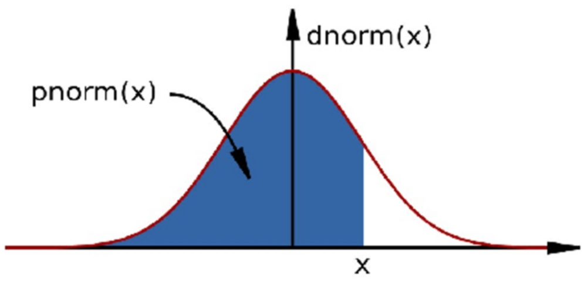

# MarkDown Syntax Examples

This is my first line.  # comment shows line end
This would be a new line.
This wouldn't be a new line.

This is my first paragraph.

This is my second paragraph

Italics = _Italics_ or *Italics*  
Bold  =  __Bold__ or **Bold**





# Top level section
## Middle level section
### Bottom level section

* First item
* Second item
+ Second item A
+ Second item B


1. First item
2. Second item
+ Second item A
+ Second item B


```
hist(rnorm(100))
```


http://mrccsc.github.io
[Github site](http://mrccsc.github.io)


Before the first page break
***
Before the second page break

# R code chunks examples

##rMarkdown


```{r} 
hist(rnorm(1000))
```

##rMarkdown. Controlling R code output - eval


```{r,eval=F} 
hist(rnorm(1000))
```

##rMarkdown. Controlling R code output - Displaying code.

```{r,echo=F} 
hist(rnorm(1000))
```

##rMarkdown. Controlling R code output - message and warnings

```{r,warning=F,message=F} 
library(ggplot2)
```

##rMarkdown. Controlling figure output.

```{r,fig.width=5,fig.height=5} 
hist(rnorm(100))
```

##rMarkdown. Automatically tidying code.

```{r,tidy=T} 
        hist( 
rnorm(100  )
      )
```

##rMarkdown. Placing code and output together

```{r,collapse=T} 
temp <- rnorm(10)
temp
```

##rMarkdown. Inserting tables.

```{r,results='asis'} 
library(knitr)
temp <- rnorm(10)
temp2 <- rnorm(10)
dfExample <- cbind(temp,temp2)
kable(dfExample)
```

##rMarkdown. Evaluating code within markdown text.

Here is some freeform _markdown_ and the first result from an rnorm call is `r rnorm(3)[1]`, followed by some more free form text.

##rMarkdown: cache

```{r,cache=TRUE} 
x <- sample(1000,10^4,replace=T)
length(x)
```


